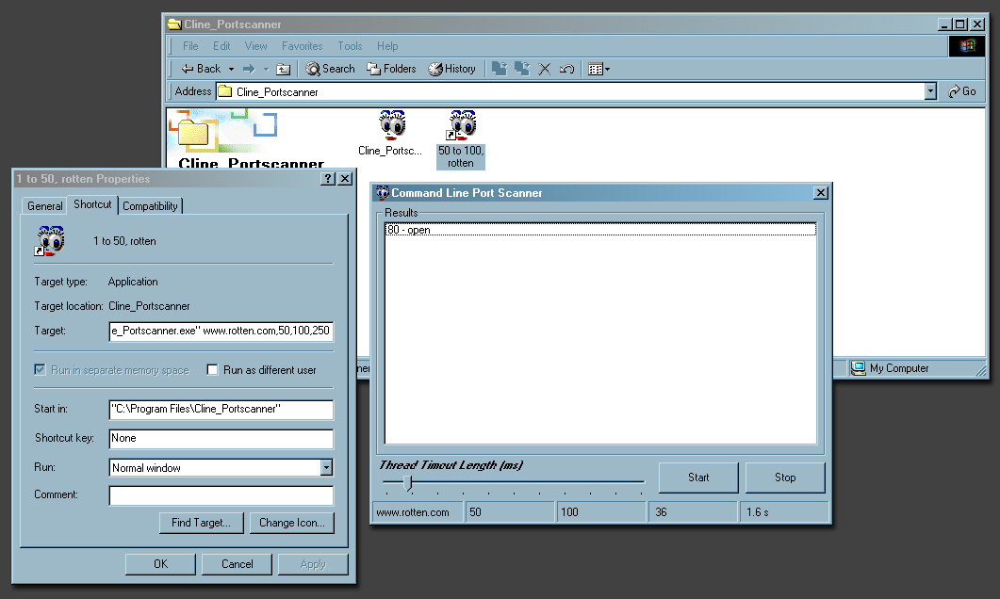



## Command Line Port Scanner \*\*Very fast\!\!\!\*\*

### Description

This is a command line version of the port scanner that I have used in Frankinal 2. The useage is, cline_portscanner.exe <ipaddress>,<start port>,<stop port>,<timout (ms)>

As you can see from the screenshot it includes a pause and stop button and also a thread timout slider so you can actually change the timeout in milleseconds whilst it scans. Which is nice. I hope you like it. Please comment on it, and if you like it download Frankinal 2 from this site as that enables you to double click on the open ports and instantly connect to them, wonderful!! Votes wouldnt go un-noticed either!
 
### More Info
 

             |
---                |---
**Submitted On**   |2001-07-28 11:15:46
**By**             |[Niknak\!\!](https://github.com/Planet-Source-Code/PSCIndex/blob/master/ByAuthor/niknak.md)
**Level**          |Advanced
**User Rating**    |4.2 (21 globes from 5 users)
**Compatibility**  |VB 6\.0
**Category**       |[Internet/ HTML](https://github.com/Planet-Source-Code/PSCIndex/blob/master/ByCategory/internet-html__1-34.md)
**World**          |[Visual Basic](https://github.com/Planet-Source-Code/PSCIndex/blob/master/ByWorld/visual-basic.md)
**Archive File**   |[Command Li236797282001\.zip](https://github.com/Planet-Source-Code/niknak-command-line-port-scanner-very-fast__1-25607/archive/master.zip)

